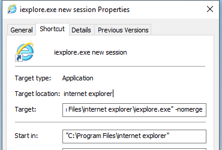

Skill List 
==============

- Open new session in IE
- Run application that blocked by IT

*********************************************************************

> Open new session in IE

Two methods to open a new session in IE

Method 1)     

- Press key <kbd>ALT</kbd> + <kbd>A</kbd> to display IE Menu, 
- select `File` | `New Session`      

Method 2)     

- Create a new softlink for IE. 
- Righ-click the link, select `Properties`, add ` - nomerge` to Target, then click button Apply and OK.     
Now you can click the link to open a new IE window.

Note:     
The path of IE `C:\Program Files\internet explorer\iexplore.exe`

*********************************************************************

> Run application that blocked by IT

copy the application folder to `c:\temp\`, then you can run it.

********************************************************

**Reference Link**

1. [不同版本IE下session管理的区别](https://blog.csdn.net/iteye_11328/article/details/82198980)
2. [记住这些快捷键你就可以基本纯键盘操作了！！](https://www.cr173.com/html/11938_1.html)

