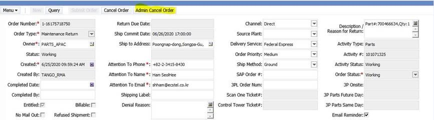

> when an order needs to be canceled due to specific reasons in Siebel and CT, please follow the steps below.

## Siebel

Document with SR Note Activity with summary of the cancellation reason and CU/BP confirmation.    
Go to the Parts activity tab and use the Admin Cancel Order Button.

- The Admin Cancel Order Button can be used after the order has been submitted (Submit Order is button greyed out).
- The Cancel Order Button can be used if cancellation is requested before submitting the order (Submit Order button is NOT grayed out).

## Control Tower

Go to the ***To be allocated tab*** and mark the request you want to cancel. In the right corner on the window, a Trash can button will appear, which will allow you directly to remove the Cancelled order.

Test local image
